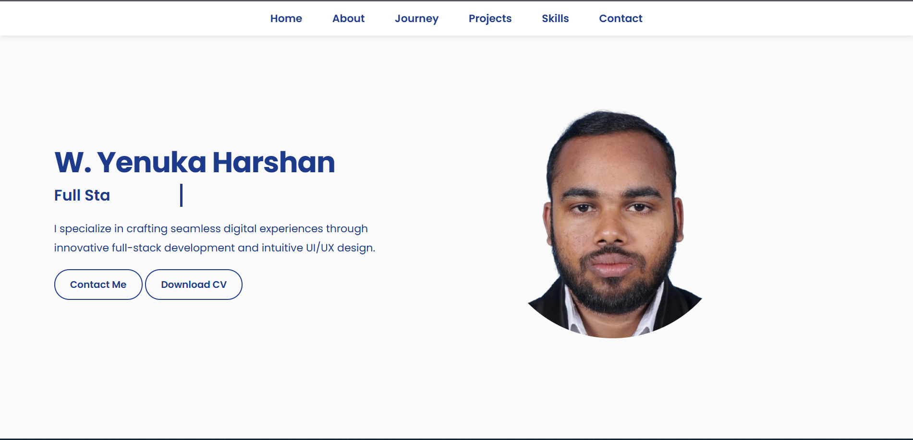

# Yenuka Harshan's Portfolio

Welcome to the GitHub repository for my personal portfolio website! This project showcases my journey as a **Full Stack Developer** and **UI/UX Designer**, highlighting my skills, projects, and passion for creating seamless digital experiences. Built with modern web technologies, this portfolio is a reflection of my commitment to innovative design and robust development.

---

## 🚀 About the Project

This portfolio is a dynamic, responsive single-page application designed to present my professional background, technical expertise, and creative projects. It features smooth navigation, a clean UI, and a toggleable light/dark mode for enhanced user experience. Whether you're here to explore my work or collaborate on exciting projects, I hope this gives you a glimpse into what I bring to the table!

### 🌟 Key Features
- **Responsive Design**: Optimized for desktops, tablets, and mobile devices.
- **Interactive UI**: Includes a typewriter effect for dynamic role display and a project carousel with smooth scrolling.
- **Theme Toggle**: Switch between light and dark modes for accessibility and comfort.
- **Sidebar Navigation**: Mobile-friendly menu for easy access to all sections.
- **Contact Form**: Integrated email functionality to connect directly with me.
- **Skill Showcase**: Visual representation of my technical proficiencies with hover effects.

---

## 🛠️ Tech Stack

The portfolio is built using a combination of front-end technologies and design tools to ensure performance and aesthetics:

- **HTML5**: Semantic structure for accessibility and SEO.
- **CSS3**: Custom styles with animations, flexbox, and media queries for responsiveness.
- **JavaScript**: Dynamic functionality like the typewriter effect, project carousel, and theme toggling.
- **Font Awesome**: Icons for social media and navigation.
- **Google Fonts (Poppins)**: Clean and modern typography.
- **Figma**: Used for prototyping the UI/UX design (inspired by the portfolio's layout).

---

## 📂 Project Structure

Here's a quick overview of the repository's file structure:

```
├── index.html         # Main HTML file
├── styles.css         # Custom CSS for styling
├── script.js          # JavaScript for interactivity
├── assets/            # Images and other static files
│   ├── Profile IMG.png
│   ├── project1.jpg
│   ├── project2.jpg
│   ├── ...
└── README.md          # You're here!
```

---

## 🎨 Design Inspiration

The portfolio draws inspiration from modern minimalism, with a focus on clean lines, bold typography, and subtle animations. The light/dark mode toggle caters to user preferences, while the project carousel makes it easy to browse my work. The paint-splash background in the hero section adds a creative flair, reflecting my passion for blending technical precision with artistic expression.

---

## 🖼️ Screenshots

### Desktop View (Light Mode)


### Mobile View (Dark Mode)


*(Note: Replace the screenshot paths with actual images after uploading them to the repository.)*

---

## 🚀 Getting Started

Want to run this portfolio locally or contribute to it? Follow these steps:

### Prerequisites
- A modern web browser (Chrome, Firefox, Safari, etc.)
- A code editor like VS Code
- Git installed on your machine

### Installation
1. **Clone the Repository**:
   ```bash
   git clone https://github.com/your-username/portfolio.git
   ```
2. **Navigate to the Project Directory**:
   ```bash
   cd portfolio
   ```
3. **Open the Project**:
   - Open `index.html` in your browser to view the portfolio.
   - Alternatively, use a local server (e.g., VS Code's Live Server extension) for a better development experience.

### Customization
- Update `index.html` to modify content (e.g., projects, skills, or contact details).
- Edit `styles.css` to tweak the design or add new themes.
- Enhance `script.js` to introduce new interactive features.

---

## 📚 Projects Highlighted

Here are some of the projects featured in the portfolio:

1. **Personal Portfolio**: A fully responsive website built with HTML, CSS, and JavaScript.
2. **Java Mini Game**: A fun game developed using Java's object-oriented programming.
3. **Coffee Website**: A visually appealing static site showcasing HTML and CSS skills.
4. **MovieHub Application**: A Flutter-based mobile app for movie enthusiasts.
5. **To-do Listing Web Application**: A full-stack app using React, Spring Boot, and MySQL.
6. **Notvia Notepad**: A cross-platform note-taking app built with Flutter.

Explore the [Projects section](#projects) in the portfolio for more details!

---

## 🤝 Contributing

I welcome contributions to enhance this portfolio! Whether it's fixing bugs, improving accessibility, or adding new features, here's how you can contribute:

1. **Fork the Repository**.
2. Create a new branch (`git checkout -b feature/your-feature`).
3. Make your changes and commit (`git commit -m "Add your feature"`).
4. Push to your branch (`git push origin feature/your-feature`).
5. Open a Pull Request with a clear description of your changes.

Please ensure your code follows the existing style and includes comments where necessary.

---

## 📬 Contact Me

I'm always excited to connect with fellow developers, designers, or potential collaborators. Reach out via:

- **Email**: [your-email@example.com](mailto:your-email@example.com)
- **LinkedIn**: [Yenuka Harshan](https://www.linkedin.com/in/yenuka-harshan-557106348)
- **GitHub**: [Your GitHub Profile](https://github.com/your-username)
- **Portfolio**: [Live Demo](#) *(Add the live link once hosted)*

Feel free to use the contact form in the portfolio to send me a message directly!

---

## 🌟 Acknowledgments

- **Font Awesome** for the awesome icon set.
- **Google Fonts** for the Poppins typeface.
- **DevIcons** for skill icon assets.
- **Figma** for design prototyping.
- My mentors and peers for their invaluable feedback and support.

---

## 📝 License

This project is licensed under the MIT License. See the [LICENSE](LICENSE) file for details.

---

*Built with 💻 and ☕ by Yenuka Harshan, 2025.*